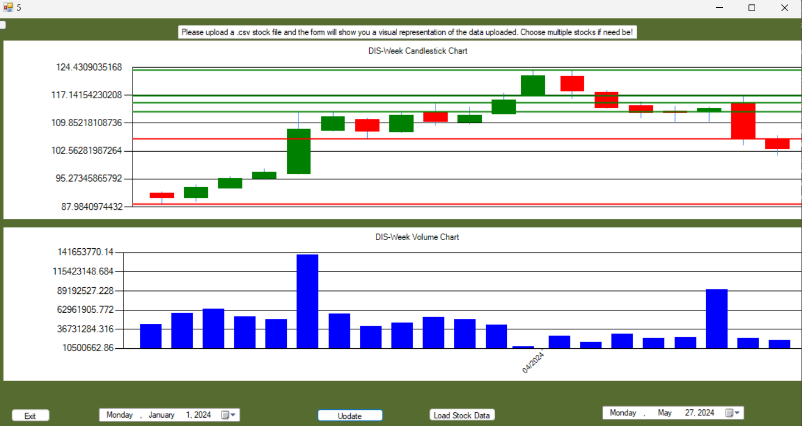

# Fibonacci Wave Predictor 🔮📈

A C# Windows Forms application for advanced stock analysis using candlestick patterns, Fibonacci wave detection, and a custom "Beauty" function to predict future price movements.

## ✨ Features

- Load OHLC stock data from Yahoo Finance (.csv format)
- Visualize candlestick charts with dynamic chart normalization
- Select custom waves between two candlesticks (using mouse or scrollbar)
- Detect valid waves using Peak/Valley pattern logic
- Compute and display Fibonacci levels inside the wave rectangle
- Calculate “Beauty” — a predictive metric based on Fibonacci confirmations
- Plot the function `Beauty(price)` to evaluate price prediction potential
- Annotate confirmed Fibonacci touches and selected candlesticks
- Support for daily, weekly, and monthly stock data
- Multi-window chart display with persistent state and live updates

## 📸 Screenshots

  
   
  <em>Wave selected with Fibonacci levels and confirmation dots</em>

  
   
  <em>Plot of Beauty(price) for wave prediction</em>

## 🛠 Technologies

- **Language:** C#
- **Framework:** .NET Framework (Windows Forms)
- **Charting:** System.Windows.Forms.DataVisualization.Charting
- **UI Tools:** WinForms, Mouse Events, Scrollbars, ToolTips
- **Design:** OOP + Data Binding

## 📁 Folder Structure
📦 OHLC-PatternDetector
┣ 📂 Stock Data
┣ 📂 Forms
┣ 📜 SmartCandlestick.cs
┣ 📜 BeautyAnalyzer.cs
┣ 📜 MainForm.cs
┣ 📜 README.md
┣ 📸 Candlestick.png
┣ 📸 BeautyGraph.png
┗ 📜 OHLC-PatternDetector.sln

## 🧠 About "Beauty"

The **Beauty function** quantifies how well a selected wave aligns with its Fibonacci retracements:
- Confirmations are counted when OHLC levels touch Fibonacci lines
- Higher Beauty values suggest more consistent, reliable price patterns
- This metric is plotted across predicted price ranges for better insights

## ⚙️ How to Use

1. Open the solution in **Visual Studio**
2. Run the project and select a stock `.csv` file (e.g., `TSLA-Day.csv`)
3. Click or drag to select two candlesticks forming a wave
4. View Fibonacci lines and wave annotations
5. Analyze the plotted `Beauty(price)` to estimate future lows or highs

## 💡 Key Learning Outcomes

- Implemented financial modeling with Fibonacci levels
- Built predictive analytics into a traditional charting system
- Applied OOP principles to encapsulate candlestick behaviors
- Developed an intuitive and interactive WinForms UI

## 📜 License

Open-source for educational and demonstration purposes. MIT License.

